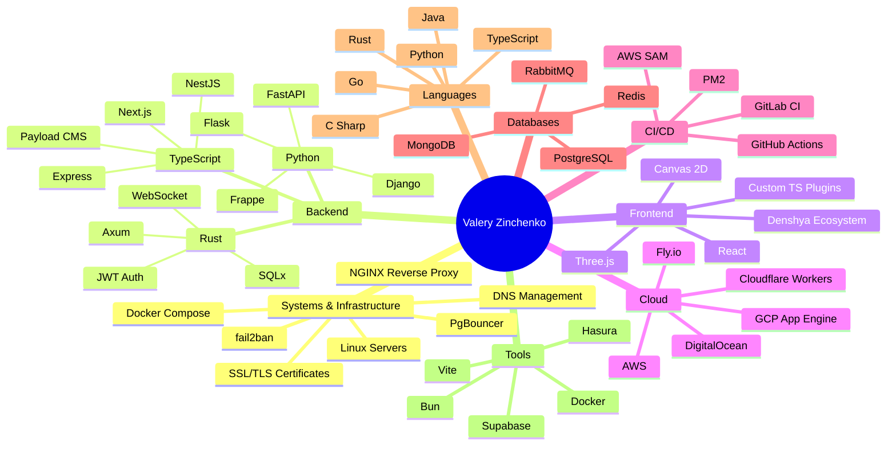

# Valery Zinchenko | Full-Stack Systems Engineer

[LinkedIn](http://linkedin.com/in/framemuse) · [StackOverflow](https://stackoverflow.com/users/story/12468111) · [Telegram](https://t.me/FrameMuse)

> I design, build and operate production systems: from React components
> to Linux servers, from zero to CI/CD. Every layer.

       

## What I Do

### Systems & Infrastructure
Provision Linux servers, harden SSH, configure **nginx** reverse proxies with SSL/TLS, fail2ban auto-jails, DNS. **Docker Compose** multi-service stacks with healthchecks. PostgreSQL at scale (50M+ rows, composite/partial indexes via `CONCURRENTLY`, PgBouncer, window functions, JSONB, full-text search). RabbitMQ, Redis and Celery: configured, debugged and production-hardened.

### CI/CD & Cloud
**GitHub Actions** (reusable workflows, composite actions, matrix builds), **GitLab CI**, **AWS SAM + Lambda**, **Amplify**, **CodeBuild**, **Cloudflare Workers**, **GCP App Engine**, **Fly.io**, **DigitalOcean** (Droplets, Spaces), **Supabase**, **Hasura Cloud**. PM2 ecosystem, S3 static hosting with OIDC, SSH-based rollouts. I own the pipeline from commit to production.

### Backend Engineering
**Primary:** TypeScript (NestJS, Express, Next.js, Payload CMS) + PostgreSQL.
**Systems:** Rust (Axum, SQLx, JWT, WebSocket, Telegram bots) for high-throughput auth and API microservices.
**Python:** FastAPI (ML classification with sentence-transformers), Django (content platforms), Flask (REST APIs), Frappe/ERPNext.
**Go, Java, C#** when the job requires it.

### Frontend Architecture
React & TypeScript: 7+ years. Custom component libraries, state management (Redux, Zustand, reactive), SSR strategies. Canvas 2D, Three.js, WebGL. Author of the **No-Framework Principle** and the **@denshya** reactive ecosystem. Custom TypeScript compiler plugins (ts-patch, ESLint, TSServer, Vite).

### Incident Response & Reliability
**RabbitMQ memory leak**: A worker processing webhooks wasn't closing connections in the catch block. Every API error created a new connection without closing the old one. After 10,000 errors the connections consumed all memory and the server OOM-killed every 2-3 hours. Fix: `finally` block guaranteeing closure, graceful shutdown, memory growth alerts. [Post-mortem](work-stories/server-attack.md)

**Brute-force attack**: CPU pinned at 100% from thousands of concurrent auth attempts. Logged in, expanded log retention to preserve evidence, applied fail2ban auto-jail after 5 failed attempts, then disabled password auth entirely and switched to SSH key-only with certificates. [Post-mortem](work-stories/server-attack.md)

**Query performance**: A 5-table join was taking 8 seconds. Analyzed EXPLAIN plan, identified a sequential scan on a massive table, added a composite index. Query dropped to 80ms. [Story](work-stories/database.md)

**Database design at scale**: Designed schemas for a CRM and transaction platform where tables grew to 50 million rows. Used B-tree, composite, partial and covering indexes. Added columns with DEFAULT NULL to avoid table locks, created indexes with CONCURRENTLY. Configured PgBouncer connection pooling. [Story](work-stories/database.md)

**Supply chain incident**: Detected malicious code injected into one of my published libraries by a colleague. Documented the discovery process and remediation. [Story](blogs/victim-of-supply-chain-attack.md)

## Projects

<b>Infrastructure & DevOps</b> (17 projects)

| Project | Description | Stack Highlights |
|---|---|---|
| [rukaku](https://github.com/FrameMuse/rukaku) | Multi-language microservice finance platform | **nginx** (6 vhosts, SSL, WebSocket, auth_request), Docker Compose, Rust, Python, TS |
| [campaign-dashboards](https://github.com/FrameMuse/campaign-dashboards) | Analytics dashboard with serverless backend | **AWS SAM + Lambda**, Hasura, Auth0, Amplify, DigitalOcean Spaces, CloudFormation |
| [ci-cd](https://github.com/FrameMuse/ci-cd) | Reusable GitHub Actions workflows | Composite actions, PM2 deploy, S3 deploy, bun/npm dual support |
| [pinely.eu](https://github.com/FrameMuse/pinely.eu) | Payload CMS site | Next.js 15, MongoDB, Docker, **AWS S3 with OIDC** |
| [smartlink-backend](https://github.com/FrameMuse/smartlink-backend) | NestJS production API | **PM2** ecosystem, **DigitalOcean** SSH deploy, GitHub Actions |
| [solana-dex-trading-bot](https://github.com/FrameMuse/solana-dex-trading-bot) | DEX trading bot | Docker Compose (3 services + healthchecks), Solana SDK, gRPC, Jito |
| [creaty](https://github.com/FrameMuse/creaty) | Content creation platform | **Docker Compose** (Postgres, Redis, Celery, Nginx, Cal.com), GitHub Actions |
| [fbz-shop-bot](https://github.com/FrameMuse/fbz-shop-bot) | Telegram commerce bot | Docker + PostgreSQL, MikroORM, Telegraf |
| [merlines_frontend](https://github.com/FrameMuse/merlines_frontend) | Frontend with CI/CD | **GitLab CI**, Docker, docker-compose |
| [feature.fm](https://github.com/FrameMuse/feature.fm) | Feature management platform | **Cloudflare Workers** (wrangler.toml) |
| [FrameMuse-Galaxy](https://github.com/FrameMuse/FrameMuse-Galaxy) | Galaxy app | **GCP App Engine** (app.yaml) |
| [rust-web](https://github.com/FrameMuse/rust-web) | Rust axum web app | **Fly.io** deployment (fly.toml) |
| [app-template](https://github.com/FrameMuse/app-template) | React project starter | Docker, GitHub Actions (build + S3 deploy), env configs |
| [plapi](https://github.com/FrameMuse/plapi) | NestJS backend | TypeORM migrations, Swagger, AWS S3, Google Analytics, PM2 |
| [fbz-shop-bot-python](https://github.com/FrameMuse/fbz-shop-bot-python) | Python Telegram bot | Docker + PostgreSQL, GitHub Actions |
| [HCF series](https://github.com/FrameMuse/HCF) | Charity fundraising sites (Water, House, Childhood, shared) | Docker, GitHub Actions, React, env configs |
| [llm/residential-proxy](https://github.com/FrameMuse/llm) | Proxy pool manager | FastAPI, aiohttp, multi-source proxy gathering, ASN verification |

<b>Backend Systems</b> (15 projects)

| Project | Description | Stack Highlights |
|---|---|---|
| [rukaku-auth](https://github.com/FrameMuse/rukaku) | Auth microservice | **Rust** (Axum, SQLx), JWT, WebSocket, Telegram bot, PostgreSQL |
| [rukaku-auth-sdk](https://github.com/FrameMuse/rukaku) | Published Rust crate | `AuthConfig`, `JwtValidator`, `require_auth` middleware, federated route guards |
| [rukaku-expenses](https://github.com/FrameMuse/rukaku) | Expenses API | Rust (Axum), invoice integration, classification, tags |
| [rukaku-income](https://github.com/FrameMuse/rukaku) | Income API | Rust (Axum), CRUD with tags/categories, federated access |
| [rukaku-budget](https://github.com/FrameMuse/rukaku) | Budget API | Rust (Axum), cross-service queries to income + expenses |
| [smartlink-backend](https://github.com/FrameMuse/smartlink-backend) | NestJS production API | TypeORM, PostgreSQL, JWT, WebSocket, Swagger |
| [plapi](https://github.com/FrameMuse/plapi) | NestJS backend | TypeORM, PostgreSQL, AWS S3, Google Analytics, Swagger |
| [campaign-dashboards SAM](https://github.com/FrameMuse/campaign-dashboards) | Serverless Lambda APIs | **AWS SAM + CloudFormation**, Lambda functions (login, forgot-password, upload), Auth0 |
| [creaty](https://github.com/FrameMuse/creaty) | Django content platform | Python/Django, PostgreSQL, Redis, Celery background workers |
| [Articulum-backend](https://github.com/FrameMuse/Articulum-backend) | Flask REST API | Python/Flask, Gunicorn, Vercel |
| [rukaku ML classifier](https://github.com/FrameMuse/rukaku) | Cross-lingual categorizer | Python/FastAPI, sentence-transformers, jina-embeddings, cosine similarity |
| [solana-dex-trading-bot](https://github.com/FrameMuse/solana-dex-trading-bot) | DEX trading strategies | TypeScript/Bun + Python (IPC), Solana SDK, PumpSwap |
| [erpnext-optora](https://github.com/FrameMuse/erpnext-optora) | ERPNext customizations | Python/Frappe, setup.py, requirements.txt |
| [PAROGO_OS_v0.5](https://github.com/FrameMuse/PAROGO_OS_v0.5) | Full-stack app | Drizzle ORM, NeonDB, SendGrid, gitleaks, Husky |
| [llm/residential-proxy](https://github.com/FrameMuse/llm) | Proxy pool server | FastAPI, aiohttp, session rotation, ASN verification |

<b>Frontend Applications</b> (25 projects)

| Project | Description | Stack |
|---|---|---|
| [smartlink-frontend](https://github.com/FrameMuse/smartlink-frontend) | Link management platform | React 19, Redux Toolkit, Socket.IO, Zod |
| [campaign-dashboards](https://github.com/FrameMuse/campaign-dashboards) | Analytics dashboard | React, Hasura GraphQL, Tailwind |
| [creaty-frontend](https://github.com/FrameMuse/creaty-frontend) | Content creation UI | React, TypeScript |
| [pinely.eu](https://github.com/FrameMuse/pinely.eu) | CMS website | Next.js 15, Payload CMS |
| [algo-academy](https://github.com/FrameMuse/algo-academy) | Algorithm learning platform | React, Docker, TypeScript |
| [HCF-Water](https://github.com/FrameMuse/HCF-Water) | Charity fundraising | React, Docker |
| [HCF-House](https://github.com/FrameMuse/HCF-House) | Charity fundraising | React, Docker |
| [HCF-Childhood](https://github.com/FrameMuse/HCF-Childhood) | Charity fundraising | React, Docker |
| [HCF-shared](https://github.com/FrameMuse/HCF-shared) | Shared HCF components | React |
| [liquidnft](https://github.com/FrameMuse/liquidnft) | NFT platform | React, ethers, web3, tronweb |
| [liquidnft-landing](https://github.com/FrameMuse/liquidnft-landing) | NFT landing page | React |
| [liquidnft-platform](https://github.com/FrameMuse/liquidnft-platform) | NFT platform v2 | React |
| [merlines-frontend](https://github.com/FrameMuse/merlines-frontend) | Business frontend | React, Docker, GitLab CI |
| [articulum-frontend](https://github.com/FrameMuse/articulum-frontend) | Articulum UI | React, Docker |
| [corpachat-frontend](https://github.com/FrameMuse/corpachat-frontend) | Corporate chat | React |
| [ATOM-SMM](https://github.com/FrameMuse/ATOM-SMM) | SMM panel | React, CRA |
| [ATOM-SMM-v1](https://github.com/FrameMuse/ATOM-SMM-v1) | SMM panel v1 | React, deploy.sh |
| [etukk-frontend](https://github.com/FrameMuse/etukk-frontend) | Etukk platform | React |
| [snayplay-markup](https://github.com/FrameMuse/snayplay-markup) | Static markup | HTML/CSS |
| [Case-Simulator-React](https://github.com/FrameMuse/Case-Simulator-React) | CS:GO case simulator | React |
| [tilt-nova-sales](https://github.com/FrameMuse/tilt-nova-sales) | Sales platform | React |
| [laughing-robot](https://github.com/FrameMuse/laughing-robot) | Fun project | React, Docker |
| [StandoffCrash](https://github.com/FrameMuse/StandoffCrash) | Casino game | Vite, React |
| [StandoffSpin](https://github.com/FrameMuse/StandoffSpin) | Casino game | Vite, React |
| [standoffup](https://github.com/FrameMuse/standoffup) | Casino game | Vite, React |

<b>Libraries & Packages</b> (21 projects)

| Package | Description | npm |
|---|---|---|
| [@denshya/tama](https://github.com/denshya/tama) | Lightweight JSX inflator (React/SolidJS alternative) | `@denshya/tama` |
| [@denshya/reactive](https://github.com/denshya/flow) | Observable reactive state management | `@denshya/reactive` |
| [@denshya/observable](https://github.com/denshya/observable) | Observable utilities | `@denshya/observable` |
| [@denshya/router](https://github.com/denshya/router) | URL pattern-based router | `@denshya/router` |
| [@denshya/navigation](https://github.com/denshya/navigation) | Navigation/routing library | `@denshya/navigation` |
| [@denshya/ssr](https://github.com/denshya/ssr) | Server-side rendering module | |
| [react-modal-global](https://github.com/FrameMuse/react-modal-global) | Global modal dialog | `react-modal-global` |
| [react-i18n-editor](https://github.com/FrameMuse/react-i18n-editor) | In-browser localization editor | `react-i18n-editor` |
| [mixedin](https://github.com/FrameMuse/mixedin) | TypeScript mixin library | `mixedin` |
| [svg-bbox](https://github.com/FrameMuse/svg-bbox) | SVG bounding box polyfill + Vite plugin | `svg-bbox` |
| [mermaid-svg-native](https://github.com/FrameMuse/mermaid-svg-native) | Pure SVG Mermaid (no headless browser) | |
| [vite-mermaid-svg](https://github.com/FrameMuse/vite-mermaid-svg) | Vite plugin for mermaid-svg-native | |
| [openapi-schema-tools](https://github.com/FrameMuse/openapi-schema-tools) | OpenAPI schema manipulation | |
| [query-tools](https://github.com/FrameMuse/query-tools) | URL query string utilities | |
| [bemer](https://github.com/FrameMuse/bemer) | BEM CSS helper | |
| [group](https://github.com/FrameMuse/group) | Object grouping library | |
| [react-zod-form](https://github.com/FrameMuse/react-zod-form) | Zod-based form validation for React | |
| [react-sai](https://github.com/FrameMuse/react-sai) | React component library | |
| [redux-reactive-accessor](https://github.com/FrameMuse/redux-reactive-accessor) | Reactive Redux accessor | |
| [universal-swagger-exporter](https://github.com/FrameMuse/universal-swagger-exporter) | Export Swagger from various formats | |
| [bench-suite](https://github.com/FrameMuse/bench-suite) | Benchmarking suite | |

<b>Frameworks & Compiler Tooling</b> (12 projects)

| Project | Description | Stack |
|---|---|---|
| [Proton](https://github.com/pinely-international/proton) | Custom JavaScript framework (2 years R&D) | TypeScript |
| [story-studio](https://github.com/FrameMuse/story-studio) | Custom TS compiler plugins | ts-patch, ESLint plugin, TSServer plugin, Vite plugin |
| [denshya/ssr](https://github.com/denshya/ssr) | Server-side rendering for Denshya | TypeScript |
| [denshya/rich-text-editor](https://github.com/denshya/rich-text-editor) | Rich text editor component | TypeScript |
| [denshya/tamablog](https://github.com/denshya/tamablog) | GitHub Action-powered blog engine | Composite action, Markdown |
| [denshya/documaru](https://github.com/denshya/documaru) | Documentation site engine | Denshya stack |
| [api-facade](https://github.com/FrameMuse/api-facade) | HTTP client pattern library + guide | TypeScript, guide |
| [react-template](https://github.com/FrameMuse/react-template) | React project template | Vite, React |
| [library-template](https://github.com/FrameMuse/library-template) | npm library starter | Rollup, SWC, SCSS |
| [ts-patch-playground](https://github.com/FrameMuse/ts-patch-playground) | TypeScript patch experiments | ts-patch, Vite |
| [folder-structure](https://github.com/FrameMuse/folder-structure) | Project structure conventions guide | |
| [project-atlas](https://github.com/FrameMuse/project-atlas) | Local-first project management | React, isomorphic-git |

<b>Game Development</b> (4 projects)

| Project | Description | Stack |
|---|---|---|
| [COH](https://github.com/FrameMuse/COH) | 3D game with navmesh pathfinding | Three.js, recast-navigation, @react-three/fiber |
| [GlobeRotation](https://github.com/FrameMuse/GlobeRotation) | Unity 3D globe | **Unity, C#** |
| [Freeze-Man](https://github.com/FrameMuse/Freeze-Man) | Unity platformer | **Unity, C#** |
| [Tower-Defense](https://github.com/FrameMuse/Tower-Defense) | Unity tower defense | **Unity, C#** |

<b>Developer Tools & VS Code Extensions</b> (4 projects)

| Project | Description |
|---|---|
| [vscode-dsl-operators](https://github.com/FrameMuse/vscode-dsl-operators) | VS Code extension for DSL operator support |
| [vscode-frontend-helper](https://github.com/FrameMuse/vscode-frontend-helper) | VS Code extension with frontend utilities |
| [react-figma](https://github.com/FrameMuse/react-figma) | React renderer for Figma |
| [game-editor](https://github.com/FrameMuse/game-editor) | 3D game editor with GPU path tracer |

## Denshya Initiative

Making the Web a better place through simple, standardized, atomized tools.
**[github.com/denshya](https://github.com/denshya)** · 18 packages + tools

## Technical Writing

| Article | Topic |
|---|---|
| [Faster JavaScript Loops Even Seniors Don't Know About](blogs/faster-loops.md) | JS engine optimization, GC elimination, loop unrolling |
| [SSR Breakdown](blogs/ssr-breakdown.md) | Server-side rendering trade-offs, hydration, caching |
| [No-Framework Principle](blogs/no-framework-principal.md) | Architecture principle for framework-independent code |
| [Code Boundaries](blogs/code-boundaries.md) | Architectural patterns for maintainable codebases |
| [API Facade Patterns Seniors Don't Talk About](blogs/api-facade-seniors.md) | HTTP client architecture patterns |
| [What React Is Actually Doing](blogs/react-doing.md) | React internals, Virtual DOM, dataflow criticism |
| [Blending Architecture](blogs/blending-architecture.md) | Designing APIs that blend with existing standards |
| [1-Year Project Retrospective](blogs/project-1-year.md) | Figma Plugin + Admin Panel + Menu App ecosystem |
| [Switched to Linux](blogs/switched-to-linux.md) | Migrating from Windows to Linux |
| [Victim of Supply Chain Attack](blogs/victim-of-supply-chain-attack.md) | Detecting malicious code in dependencies |

## Keep Reading

- [Extended Bio](bio.md): the full journey from PHP at 11 to Rust microservices
- [Full Resume](Resume.md): detailed work history, education, certifications
- [Work Stories](work-stories/): server attacks, database crises and production incidents
- [Early Projects](early-projects/): PHP, jQuery and CS:GO gambling sites from 2015. Been at this a while.
