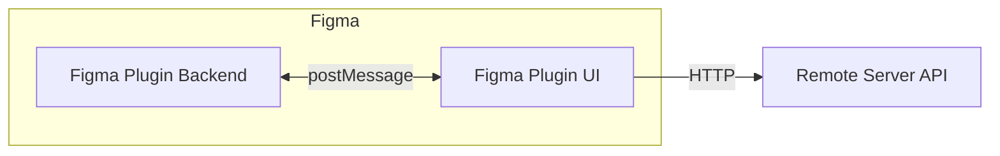
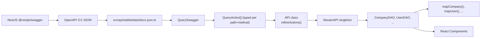

## Architecture (Heavy Technical)

### The Dual Backend Problem

Figma plugins have their own "backend", which is Figma itself, this means a Figma Plugin project with fetching remote data consists of 3 layers: UI, Figma, Remote.



The "Figma Plugin Backend" has full `figma.*` API. It can create nodes, read `pluginData`, walk the document tree. But it cannot make HTTP requests, it cannot render React.

The "Figma Plugin UI" is hosted on a `iframe`, which gives full DOM and network access. But it cannot access `figma.*` in any way.

The "Remote Server API" is where the shared product data lives: MongoDB, S3, Auth, POS.

As "Figma Plugin Backend" can act as Request-Response (just like a server) too, it needed a custom MEP router to regulate timeout, async requests/responses and guarantee type safety.

I built a protocol and folder structure to ensure that these layers are well-fenced and doesn't leak into each other.

```
packages/
  code/
    code/src/
      events/         <- Events sent via `postMessage` between 2 Figma layers.
      serialize/
      deserialize/
      index.ts
  ui/                 <- Domain-sliced folder structure
  shared/api/         <- Remote Server API, accessible to both layers.
```

#### One-Way Messages

"Figma Plugin UI" sends an action, "Figma Plugin Backend" processes it, no response expected.

| Event | Purpose |
|---|---|
| `COMPANY_ID` | Store selected company in `clientStorage` |
| `smartTextNodeUpdate` | Push text content change into a Figma text node |
| `DESIGN_NAME_UPDATE` | Rename a design entity |
| `DESIGN_FONT_REPLACE` | Replace font family across selected text nodes |
| `SAVE_DESIGNS_RECAPTURE` | Re-capture current selection as new design snapshot |
| `OPEN_EXTERNAL` | Open a URL in the external browser |

Sender side in the UI:

```typescript
class FigmaInternal {
  static broadcast(type: "smartTextNodeUpdate", payload) {
    window.parent.postMessage({
      pluginMessage: { type, payload },
      pluginId: "1355580441198092911"
    }, "https://www.figma.com")
  }
}
```

The `pluginId` is required, Figma checks it, it's unique per plugin, so it's hardcoded.

#### Request-Response Messages

Query-await-reply. UI sends a typed request, sandbox processes and posts the response. The `events/requests/` directory exists for exactly this pattern:

```typescript
// Sandbox side: one handler, one response
function onRequestEvents() {
  figma.ui.on("message", async message => {
    if (message.type !== "AVAILABLE_FONTS") return

    figma.ui.postMessage({
      type: "AVAILABLE_FONTS",
      payload: await availableFonts()
    })
  })
}
```

The UI side uses `PluginEvent.until()` to bridge the async gap:

```typescript
class PluginEvent {
  constructor() {
    window.addEventListener("message", event => {
      if (event.data.pluginId !== "1355580441198092911") return
      const action = event.data.pluginMessage
      // dispatch to listeners
    }, { capture: true, passive: true })
  }

  until<Action>(event: Action["type"]): Promise<Action["payload"]> {
    return new Promise((resolve, reject) => {
      setTimeout(() => reject(new Error(`${event} timed out`)), 10_000)
      this.once(event, action => resolve(action.payload))
    })
  }
}
```

10-second timeout. If sandbox is unresponsive (e.g., font loading hangs), the promise rejects and the UI can show an error instead of hanging forever.

I wrapped this into a DAO pattern over postMessage:

```typescript
class FigmaDAO {
  async availableFonts(): Promise<FontName[]> {
    FigmaInternal.broadcast("AVAILABLE_FONTS")
    return PluginEvent.until("AVAILABLE_FONTS")
  }
}
```

The UI developer calls `await FigmaDAO.availableFonts()` and gets typed results, unaware that it went through postMessage and validation pipeline.

#### The Relaunch Cycle

Figma has special Figma native buttons directly on their UI, which are "Menu Items" (confused with POS Menu Items).

On a click, Figma relaunches the plugin with `figma.command` variable. The "Figma Plugin Backend" checks it and notifies the UI about it.

Flow:
1. User clicks "Save" in Figma context menu
2. Plugin relaunches. `figma.command === "SAVE_DESIGNS"`
3. "Figma Plugin Backend" (`onRelaunchEvents`) processes the command, simplifies selected nodes, uploads images to S3
4. "Figma Plugin Backend" sends `FigmaCommandAction` to UI via `figma.ui.postMessage()`
5. UI's `PluginCommand` captures the message, persists to `window.history.state.usr.pluginCommand`

```typescript
class PluginCommand {
  private deferredPayload = new Deferred()

  constructor(type: "SAVE_DESIGNS") {
    const persisted = window.history.state?.usr?.pluginCommand
    if (persisted?.type === type) {
      this.deferredPayload.resolve(persisted.payload)
      return
    }
    PluginEvent.once(type, command => {
      router.navigate({}, { replace: true, state: { pluginCommand: command } })
      this.deferredPayload.resolve(command.payload)
    })
  }

  useCapture(): Payload {
    const { awaited, promise, value } = this.deferredPayload
    if (!awaited) throw promise  // Suspense boundary catches this
    return value
  }
}
```

The `useCapture()` method throws a promise, React Suspense catches it, waits for resolution, re-renders. The UI does not render until the "Figma Plugin Backend" sends the command payload.

The command payload is persisted in `history.state`, so it survives client-side navigation. If the user navigates away and back, the command is still available without re-triggering the "Figma Plugin Backend".

#### Remotely Hosted UI

For development, the "Figma Plugin UI" is baked into the plugin, which is easy to develop and debug. But production version needs to sit on a dedicate domain just like a regular website, so it can store user-unique data normally.

So in production, Figma Plugin uses a simple HTML string that redirects to `https://figma.streameditor.net`.

```typescript
function initUI() {
  const eventUrl = figma.command.length > 0 ? "/events/" + figma.command : ""
  const UI = `
    <script>
      window.location.replace(new URL(${JSON.stringify(eventUrl)}, ${JSON.stringify(url)}));
    </script>
  `
  figma.showUI(UI, { width: 441, height: 529 })
}
```

The redirect URL includes the `figma.command` as a path segment. This lets the React router serve the correct page directly: `/events/SAVE_DESIGNS` renders the save interface, `/events/REFRESH_DESIGNS` renders the refresh interface.

### The Design Viewer

The bet-the-project decision. I chose to compile Figma Design JSON to native HTML/CSS instead of rendering on a Canvas. Everyone questioned it. Canvas would be simpler - one surface, pixel control, no browser layout quirks. But I wanted text selection, accessibility, React integration, and the ability to overlay interactive elements on top of designs.

The core insight: Figma nodes map naturally to HTML elements with CSS. A FRAME with `layoutMode: "HORIZONTAL"` is a flex container. A TEXT node is a `<p>`. A GROUP is a `<section>`. Fills become backgrounds. Effects become box-shadows.

I built the Design Viewer library (`@streamllc/figma-design-viewer`) around a pipeline:

SimplifiedNode JSON -> Design tree -> `NodeCSSFactory` dispatch -> typed CSS classes -> `YieldableCSS` adapter chain -> React elements

```typescript
class Design {
  readonly rootNode: NodeProperties
  readonly nodes: NodeProperties[] = []
  readonly fonts: Map<string, DesignFont> = new Map

  constructor(rootNode: NodeProperties) {
    this.rootNode = { ...rootNode, x: 0, y: 0 }
    this.traverse(rootNode, node => {
      this.nodes.push(node)
      if (node.type === "TEXT") this.deriveFontsFrom(node)
    })
  }
}
```

`NodeCSSFactory` dispatches by Figma type:

```typescript
class NodeCSSFactory {
  static create(element: DesignElement): NodeCSS {
    switch (element.node.type) {
      case "FRAME": return new FrameNodeCSS(element)  // flex/grid layout
      case "TEXT":  return new TextNodeCSS(element)    // text properties
      case "GROUP": return new BaseNodeCSS(element)    // section wrapper
      default:      return new DefaultNodeCSS(element)
    }
  }
}
```

Each CSS class implements methods named after CSS properties:

```typescript
class FrameNodeCSS extends DefaultNodeCSS {
  display() {
    if (this.node.layoutMode === "HORIZONTAL") return "flex"
    if (this.node.layoutMode === "VERTICAL") return "grid"
  }
  gap() {
    return `${px(this.node.itemSpacing)} ${px(this.node.counterAxisSpacing)}`
  }
  alignItems() { return kebabCase(this.node.counterAxisAlignItems) }
  justifyContent() { return kebabCase(this.node.primaryAxisAlignItems) }
  padding() { ... }
}
```

Then `YieldableCSS` does the magic. It walks the prototype chain, finds every method, calls it, wraps result in `CSSAdapter`, builds a complete `CSSProperties` object. Adding a new CSS property means adding a method - no switch, no registry, no plugin.

```typescript
class YieldableCSS {
  yield(): CSSProperties {
    const style: Record<string, string> = {}
    this.traverseMethods(method => {
      const adapter = CSSAdapter.from(method.call(this))
      if (adapter.value != null && adapter.value !== "") {
        style[kebabCase(method.name)] = adapter.value
      }
      Object.assign(style, adapter.override)
    })
    return style
  }
}
```

The coordinate system was the hardest part. Figma uses absolute positioning relative to parent. But group nodes apply affine transforms. A child inside a rotated group has coordinates relative to group, but the group has its own position and transform.

I wrote `FigmaMatrix` for this:

```typescript
class FigmaMatrix {
  static fromCollapsed(values: Transform)
  invert(): this
  multiply(other: Transform): FigmaMatrix
  toArray(): [number, number, number, number, number, number]
}
```

For nested groups: invert parent transform, multiply with child transform, extract translation. This took a week to get right.

```typescript
transform() {
  if (this.parentNode.type === "GROUP" && this.parentNode.relativeTransform != null) {
    const matrix = FigmaMatrix.fromCollapsed(this.parentNode.relativeTransform)
    matrix.invert()
    const offsetMatrix = matrix.multiply(this.node.relativeTransform)
    return new TransformAdapter(offsetMatrix.toArray())
  }
  return new TransformAdapter(this.node.relativeTransform)
}
```

Then came the SmartText system - the feature that made the whole thing worth it. The idea: let users tag text nodes in Figma as "MenuItemTitle" or "MenuItemPrice". Store entity IDs on the node via `pluginData`. At render time, resolve live data from API and inject into the static design.

```typescript
// In Figma, on each text node:
node.setPluginData("smartTextEntity", JSON.stringify({
  id: menuItem.id,
  type: SmartTextType.MenuItemTitle
}))
```

The `SmartNode` class manages this encoding:

```typescript
class SmartNode {
  static readonly ENTITY = "smartTextEntity"

  static encodeEntity(entity: SmartNodeEntity) {
    return { [SmartNode.ENTITY]: entity }
  }

  static extractEntity(node: BaseNode): SmartNodeEntity | null {
    try {
      return JSON.parse(node.getPluginData(SmartNode.ENTITY))
    } catch { return null }
  }
}
```

At render time, `DesignElementText` checks for entity:

```typescript
class DesignElementText {
  resolve() {
    const smartTextContent = this.getSmartText()
    if (smartTextContent != null) return smartTextContent
    return this.element.node.characters
  }

  private getSmartText() {
    const entity = this.element.node.pluginData?.smartTextEntity
    if (entity == null) return
    return this.element.resolvers.transformText(this.textContent, entity)
  }
}
```

The React side provides menu items through Context:

```typescript
const menuItemsContext = createContext<Map<string, MenuItem>>(new Map)

function useMenuItem(id: string): MenuItem {
  const menuItems = useContext(menuItemsContext)
  return useMemo(() => menuItems.get(id) ?? {
    id: "-1", price: -1, title: "[ID not found]"
  }, [id, menuItems])
}
```

`useMenuItem` returns the live price. If item is sold out, `MenuItem.priceOverride: "SOLD"` replaces the number. If price changed, WebSocket pushes new map, Context updates, React re-renders. Static design becomes live menu.

The Design Viewer handled type coverage well: FRAME, TEXT, GROUP, RECTANGLE, ELLIPSE, LINE, POLYGON, STAR, VECTOR, BOOLEAN_OPERATION, COMPONENT, COMPONENT_SET, SECTION, etc. Everything except Prototypes (animations). With a teammate's help we covered Figma features fast.

### Node Serialization

The backbone connecting everything. Save a design: convert Figma nodes to JSON. Load a design: convert JSON back to Figma nodes.

Simplify -> JSON -> REST -> JSON -> Restore

**Simplify** (`NodeSimplifier`) takes `SceneNode[]` from selection:
1. Validates type against whitelist (21 creatable types). GROUP and INSTANCE can't be created directly but can be built.
2. Extracts only `nodeChangeableProperties` - 114 properties listed in `consts.ts`. Layout (padding, itemSpacing, layoutMode), geometry (width, height, x, y), visual (fills, strokes, effects), text (characters, fontSize, styledTextSegments), boolean ops.
3. For TEXT: captures `styledTextSegments` - each segment has its own font, size, color, letterSpacing, lineHeight. Figma stores these separately from `characters`.
4. Extracts `pluginData` (including our SmartText entities) and `relaunchData`.
5. Images: upload fill images to S3, store hash.
6. Returns `SimplifiedNode` - plain JSON.

**Restore** (`NodeRestorer`) does reverse:
1. `FigmaNodeCreator` factory instantiates correct node type.
2. Assign properties in strict dependency order: layout mode -> sizing -> dimensions -> position -> fills -> strokes -> effects -> corner radius. Wrong order and Figma fights you. Set dimensions before layoutMode and Figma auto-resizes to content.
3. TEXT: `figma.loadFontAsync()` for every font variant, then `figma.setRangeFontName()`, `figma.setRangeFontSize()` for each segment.
4. Images: `NodeImageRestorer` downloads from S3 hash, creates `ImagePaint` fill.
5. Restore `pluginData` and `relaunchData`.
6. Groups: create temp FRAME, append children, call `figma.group()`.
7. COMPONENT: create as component first, then set properties.

```typescript
class SmartTextNode implements Omit<SimplifiedNode<TextNode>, "children"> {
  readonly type = "TEXT"
  readonly leadingTrim = "CAP_HEIGHT"
  readonly fontSize = 24
  readonly characters: string
  readonly pluginData: SimplifiedPluginData

  constructor(entity: SmartTextNodeEntity, node?: Partial<SimplifiedNode<TextNode>>) {
    Object.assign(this, node)
    this.characters = entity.content
    this.children = [entity.content]
    this.pluginData = { [SmartTextNode.ENTITY]: entity }
  }
}
```

`SmartTextNode` can also push updates *into* Figma. `SmartTextNode.update(id, type, newContent)` calls `FigmaInternal.broadcast("smartTextNodeUpdate", payload)` which hits the sandbox's `onSmartTextNodeUpdate` handler, which finds matching text node by `pluginData` and replaces characters. Live editing from the web app into the Figma canvas.

### POS Integrations

After all the dual-backend complexity, I wanted the integration layer to be clean. Simple. Predictable.

Plugin pattern:

```typescript
interface POSIntegration {
  service: new (clientId, context) => POSService
  webhook: new (request) => POSWebhook
}
```

Each POS system implements two classes and a binder.

**POSWebhook** parses incoming request:

```typescript
class SquarePOSWebhook extends POSWebhook<SquareWebhookBody> {
  public verification = null      // Square is trusted by design
  public trusted = true

  public clientIds = this.request.body.orders.map(o => o.locationId)
  public getOrderIds(clientId: string): string[] {
    return this.request.body.orders
      .filter(o => o.locationId === clientId)
      .map((_, i) => i.toString())
  }
}
```

**POSService** processes orders:

```typescript
class SquarePOSService extends POSService<SquareWebhookBody> {
  public getOrderStatus(orderId: string): "COMPLETED" | "OPEN" | "IGNORED" {
    const order = this.getOrder(orderId)
    if (order.state === "COMPLETED") return "COMPLETED"
    return "OPEN"
  }

  public getOrderData(orderId: string) {
    const order = this.getOrder(orderId)
    return {
      items: order.lineItems?.map(item => ({
        name: item.name,
        modifiers: item.modifiers?.map(m => m.name),
        price: item.basePriceMoney.amount,
        quantity: item.quantity,
      })),
      taxPrice: order.totalTaxMoney.amount,
      finalPrice: order.totalMoney.amount,
    }
  }
}
```

**Binder** ties them together:

```typescript
const SquarePOSIntegration = {
  service: SquarePOSService,
  webhook: SquarePOSWebhook,
} satisfies POSIntegration
```

Registered in static `IntegrationManager`:

```typescript
class IntegrationManager {
  static registry = new Map<string, POSIntegration>()

  static register(name: string, integration: POSIntegration) {
    this.registry.set(name.toLowerCase(), integration)
  }
}
```

Route: `POST /integration/webhook/:posName`

Flow:
1. Request hits `IntegrationController.Webhook()`
2. `IntegrationManager.find(posName)` gets `{service, webhook}`
3. `new webhook(request)` validates, extracts `clientIds`, `orderIds`
4. For each client: `new service(client, context)` checks status, fetches data
5. Results emitted via `OCBGateway.EmitOrder(screenId, event, order)` to the right socket room

Concurrency pattern: `Promise<Update>[]` not `Promise<Update[]>`. Each order update fires independently. No awaiting all before sending. Orders arrive at screens in parallel instead of serialized behind the slowest one.

```typescript
const updates: Promise<POSServiceUpdate>[] = []
for (const clientId of webhook.clientIds) {
  for (const orderId of webhook.getOrderIds(clientId)) {
    updates.push(processOrder(clientId, orderId))
  }
}
// Each update emits to socket as it resolves
```

Separate `MenusIntegrationModule` handled menu data sync - a different problem from order processing. Menu sync ingests item catalog from POS systems, while order processing handles live transactions. Two integration systems, one plugin pattern.

**8 integrations implemented:**

| POS | Orders | Menu Sync | How |
|---|---|---|---|
| Clover | Yes | No | Webhook (OAuth) |
| Square | Yes | No | Webhook |
| Focus | Yes | No | Webhook |
| Oracle | Yes | Yes | Cron polling |
| CBS NorthStar | Yes | Yes | Cron + webhook |
| TableNeeds | Yes | Yes | Webhook |
| Qu | Yes | No | Webhook |
| HolidayOil | Yes | No | Webhook |

Menu sync used cron (`@nestjs/schedule`) for polling every hour. Availability checks every 5 minutes. Token refresh every day at 1AM.

### API Facade

The admin panel and plugin UI both needed the same thing: type-safe API calls without manual type maintenance. Every time backend changed a response shape, two frontends broke. I needed a system where the frontend could derive types directly from what the server already produced.

The NestJS server already generated OpenAPI 3.0 JSON via `@nestjs/swagger`. That spec was the contract. If I could derive types from it, any change to the backend would automatically propagate to frontends - no manual type files, no sync meetings, no "did you update the types?" Slack messages.

I wrote a library called `openapi-schema-tools`. It derives TypeScript types from OpenAPI schemas at compile time (resolving `$ref`, `allOf`, `oneOf` chains) and it validates data against those schemas at runtime with mock fallback.

#### The Layer Stack



#### openapi-schema-tools

The foundation. Library exports:

| Export | Purpose |
|---|---|
| `SchemaMocker` | Generates fake data from any OpenAPI schema. Walks `$ref`, resolves allOf/oneOf, produces valid fake objects. |
| `SchemaSatisfier` | Takes partial data + schema, returns full valid data. Two modes: `required` (drops unknown fields), `mocked` (fills missing with generated data). |
| `ResolveSchema<Schema, Context>` | TypeScript type-only resolver. Recursively follows `$ref`, `allOf`, `oneOf`, `anyOf` at compile time. Powers `typeof APIDocsSwagger.schemas.User._plain`. |
| `SchemaValidator` | Validates data against schema. Returns structured issues, doesn't throw. |
| `SchemaConverter` | Converts between OpenAPI versions (3.0 ↔ 2.0). |

`ResolveSchema` is the real value. It turns this:

```typescript
const UserSchema = { allOf: [{ $ref: "#/components/schemas/BaseEntity" }, { type: "object", properties: { name: { type: "string" } } }] }
```

Into the resolved TypeScript type `{ _id: string, createdAt: string, name: string }` automatically. No manual type definitions needed.

#### QuerySwagger

The parser. Takes the raw OpenAPI JSON snapshot. Iterates every path and method. For each operation, creates a `QueryAction` with four pieces of information: path template, HTTP method, request body schema, response payload schema.

```typescript
// Simplified from QuerySwagger.ts
for (const path of Object.keys(docs.paths)) {
  for (const method of Object.keys(docs.paths[path])) {
    const operation = docs.paths[path][method]
    const requestBodyShape = parseContent(operation.requestBody)
    const responsePayloadShape = parseContent(operation.responses?.["200"])

    this.actions[path][method] = new QueryAction({
      path,
      method: method.toUpperCase(),
      requestBodyShape,
      responsePayloadShape
    })
  }
}
```

`parseContent` looks at the `content` field (e.g. `application/json`), determines the `BodyType` ("json", "formData", "blob", "text"), and wraps the schema in a `QueryShape`. The `QueryShape` pairs a body type with a `QuerySchema` (which uses `SchemaSatisfier`/`SchemaMocker` for validation and mocking).

#### QueryAction and the Request Lifecycle

`QueryAction` is the atomic unit. It knows how to build a native `Request` object from a typed request.

```typescript
class QueryAction {
  async toRequest(baseURL: string, request?: QueryRequest): Promise<Request> {
    // Resolve URL: path variables + query params
    const url = this.endpoint.toURL(baseURL, {
      variables: request?.pathParams,    // { _id: "abc" } → /company/abc
      queryParams: request?.queryParams  // { name: "foo" } → ?name=foo
    })

    // Parse body: object → JSON string, FormData stays FormData
    const body = await this.parseRequestBody(request?.body)

    // Auto-detect Content-Type
    const headers = this.resolveRequestHeaders(request)

    return new Request(url, { method: this.method, body, headers })
  }
}
```

`Endpoint.toURL()` resolves path templates like `/company/{_id}` by substituting variables. Query params are encoded as `key=value&...`. The body parser converts objects to JSON, keeps FormData as-is, handles Blob and ArrayBuffer.

`resolveRequestHeaders` automatically sets `Content-Type: application/json` for object bodies. For FormData, it omits Content-Type (browser sets boundary automatically).

Full request lifecycle:

1. **Consumer calls** - `StreamAPI.fetch.GET["/company/{_id}"]({ pathParams: { _id: id } })`
2. **`API.query()`** - calls `fetchAction()`
3. **`action.toRequest()`** - builds native `Request` object with URL, headers, body
4. **Authorization** - `APIAuthorization.resolve()` attaches JWT token
5. **`fetch(request)`** - native browser fetch
6. **Error check** - status ≥ 400 → `QueryError.fromResponse()` parses server error body
7. **`action.resolveResponsePayload()`** - calls `response.json()` or `response.text()` based on content type
8. **Shape** - `this.shape(schema, value)` runs schema validation with auto-mock fallback
9. **Return** - `{ payload, status, headers, nativeResponse }`

#### The StreamAPI Singleton

All this wires together in `api/stable/APIStable.ts`:

```typescript
const APIDocs = await import("./data/docs.json")  // committed OpenAPI snapshot
const APIDocsSwagger = new QuerySwagger(APIDocs)

const StreamAPI = new API({
  baseURL: import.meta.env.VITE_API_HOST,
  queryClient: queryClient,
  swagger: APIDocsSwagger,
  options: {
    endpoint: { includeVersion: true, includeTrailingSlash: true },
    request: {
      security: {
        tokens: [{
          header: "Authorization",
          read: () => localStorage.getItem("user-token"),
          async refresh(expiredToken) {
            const response = await this.fetch.POST["/auth/refresh-token"]({
              body: { accessToken: expiredToken },
              noSecurity: true  // prevent recursive auth
            })
            localStorage.setItem("user-token", response.payload.accessToken)
            return response.payload.accessToken
          }
        }]
      }
    },
    debug: { enabled: import.meta.env.DEV, mock: "auto" }
  }
})

StreamAPI.on("error", (action, request, error) => {
  if (error instanceof QueryClientError && error.status === 401) {
    UserDao.logOut()  // auto-logout on expired token
  }
})
```

The spec is imported from a committed `.ts` file - a snapshot of `GET /api-json` from the server. Kept in version control so frontend builds don't need the server running. Update it: re-export from server, replace the file, commit.

#### Auto-Mock in Development

The most controversial decision. In development, if the API returns data that doesn't match the schema, the facade does not crash.

```typescript
private async shape(schema, value) {
  if (this.config.debug.mock === "always") return schema.mock()

  try {
    return schema.form(value, "mocked")  // fill missing fields with fake
  } catch (ZodError) {
    this.events.emit("mocked")
    return schema.mock()  // complete mock on failure
  }
}
```

Three modes. `never` is strict - validation error throws. `always` generates entirely fake data, ignoring the response completely. `auto` tries to satisfy the schema with received data, fills whatever is missing with generated values, and if even that fails, falls back to full mock.

The `"mocked"` event fires so dev tools can flag it. In production, `mock` is `never`. The trade-off: during development, you see the app working with placeholder data instead of crashing on every schema mismatch. The mismatch is logged, not silenced. But I know some people hate this - they'd rather crash hard and fix immediately. For this project, with two frontends and a fast-moving backend, the pragmatic choice saved more time than it cost.

#### JWT Auth Lifecycle

Batched token refresh. When 10 components mount simultaneously and all fire API calls, only one refresh request fires.

```typescript
class APIAuthorization {
  private newTokenPromise: Promise<string> | null = null

  async ensureFreshJWT() {
    // Batched: if another request is already refreshing, wait on same promise
    if (this.newTokenPromise != null) await this.newTokenPromise

    const token = securityToken.read()
    if (token == null) return null

    const currentJWT = new JWT(token)
    if (currentJWT.expiryTime > 30_000) return currentJWT    // fresh enough
    if (currentJWT.expiryTime <= -15 days) return null        // too old

    this.newTokenPromise = securityToken.refresh(currentJWT.token)
    const newToken = await this.newTokenPromise
    this.newTokenPromise = null
    return new JWT(newToken)
  }
}
```

The `newTokenPromise` field is the batching lock. First request hits expiry, starts refresh, stores the promise. All subsequent requests see `newTokenPromise != null` and await the same promise. One refresh, 10 consumers.

Pre-emptive refresh at 30 seconds before expiry prevents mid-session token expiration. Tokens older than 15 days are treated as expired - forces re-login rather than refreshing indefinitely stale credentials.

#### The DAO Layer

Above the raw API calls sits the DAO layer. Every entity has a DAO class that wraps `StreamAPI.fetch` with business logic, mapping, and side effects.

```typescript
// entities/company/company.dao.ts
class CompanyDAO {
  async find(id: string): Promise<Company> {
    const response = await StreamAPI.fetch.GET["/company/{_id}"]({
      pathParams: { _id: id }
    })
    return mapCompany(response.payload)
  }

  @ToastResult("Company", "Create", "Created")
  async create(dto: CompanyCreateDTO) {
    const company = await this.createBase(dto)
    await Promise.all([
      dto.companyLogo && this.updateLogo(company.id, dto.companyLogo),
      this.userDao.create({ ...dto.owner, companyId: company.id })
    ])
  }
}
```

DAO isolates multi-request composition. `create()` calls three endpoints (create company, create owner, upload logo) but the consumer sees one method, one call, one promise. `@ToastResult` decorator adds success/error notifications automatically based on method name and result.

```typescript
@ToastResult("Company", "Create", "Created")
// → success: toast "Company Created"
// → error: toast "Failed to create Company"
```

DAO is also where the **Notion Resource class concept** would have lived. The `resource.md` note described a `Resource` base class with change listeners:

```typescript
class UserResource extends Resource {
  get() → data with caching
  add() → POST + invalidate cache
  addEventListener("change", handler) → reactive updates
}
```

It was never built. DAOs + TanStack Query (`@tanstack/react-query`) covered the same ground. `useQuery` provides reactive data, `queryClient.invalidateQueries()` manages cache, mutations handle writes. The `Resource.addEventListener` pattern would have duplicated TanStack Query's observer system.

But the **Resource Branch/Draft** concept was genuinely novel and never implemented - a way to fork API data into local state, mutate freely, then merge back with a strategy. Would have been useful for the OCB settings editor, where users modify layout config locally before saving.

#### Mappings

Every DAO calls a pure mapping function after receiving raw API data:

```typescript
// api/stable/mappings/company.ts
export function mapCompany(schema: typeof APIDocsSwagger.schemas.Company._plain): Company {
  return {
    id: schema._id as unknown as string,
    logo: schema.logo?.url ?? DefaultImageJPG,
    title: schema.name,
    status: mapCompanyStatus(schema),
    owner: { id: schema.owner?._id, firstName: schema.owner?.firstName, ... }
  }
}
```

Mappings are always one direction: API shape → app shape. They handle key renaming (`_id` → `id`), type coercion (numbers to enums), default values, null safety. `BiMap` helper handles bidirectional enum values:

```typescript
const companyStatus = new BiMap({
  1: CompanyStatus.Active,
  2: CompanyStatus.PendingDeletionRequest,
})
```

The mapping files are the documented boundary between what the API returns and what the app consumes. When the API changes a field, the mapping breaks at compile time - TypeScript catches it immediately.

#### Three WebSocket Gateways

The facade also includes Socket.io integration for real-time updates. `SocketManager` deduplicates connections:

```typescript
class SocketManager {
  private sockets = new Map<string, Socket>()

  get(url: string) {
    const cached = this.sockets.get(url)
    if (cached != null) return cached

    const socket = io(url)
    this.sockets.set(url, socket)
    return socket
  }
}
```

One connection per URL. Prevents the "socket multiplication" bug where every component mount creates a new connection.

The server exposes three gateways with different namespaces and auth:

**OCBGateway** (no namespace). Order display boards. Clients connect with `OcbClient`, join room by `company_id`. Receives `new order`, `order completed`, `order cancelled` events. Events target specific `screenId`, not broadcast - each physical screen sees only its own orders.

**MenuGateway** (`/menu`). Menu display screens. Clients connect with `MenuClient` (companyId + locationId), join room `companyId-locationId`. Events: `menuUpdated(menuId)`, `designUpdated(designId)`. Admin panel queries `getListOfConnectedSocketsByRoom()` to show "3 screens online."

**AdminPanelGateway** (`/AdminPanel`). JWT-authenticated via `INITIATE_CONNECTION` event. Admin users join `ALL`. Company owners join only `company._id`. Provides `CONNECTED_MENUS` and `CONNECTED_OCBS` queries.

The admin panel's `StreamAPISocket` wraps this:

```typescript
class StreamAPISocket {
  constructor(namespace: string) {
    const url = new URL(namespace, import.meta.env.VITE_API_HOST)
    this.socket = SocketManager.get(url.toString())
    this.socket.emit("INITIATE_CONNECTION", this.authToken)
  }

  on(event, listener) { /* typed event listeners */ }
  [Symbol.dispose]() { /* cleanup */ }
}
```
