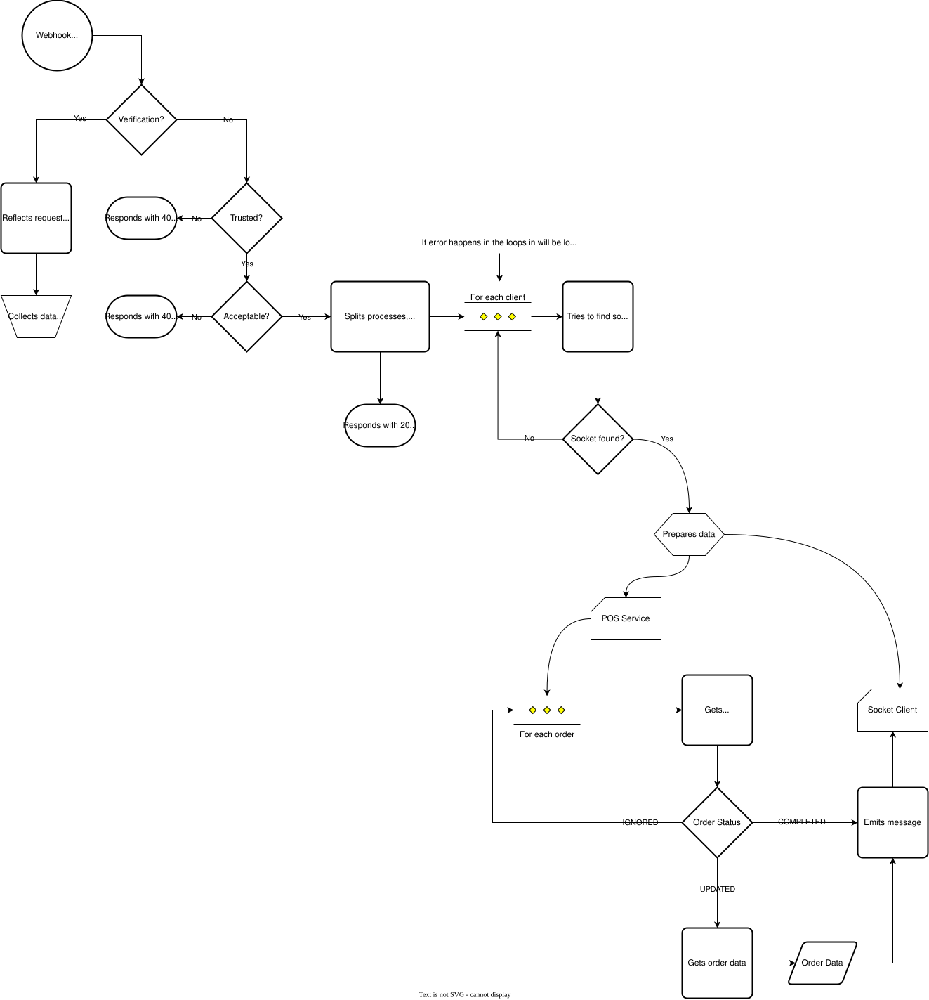

# Guidelines

## Adding a new integration

Integration in our case is webhook handler + API calls, sometimes we will have all the information about orders provided

<aside>
ℹ️ For example let’s assume that we’re integrating a **Square** POS

</aside>

### Create the structure

- Create folder in `src/integration/integrations/` with the name + POS (e.g. `SquarePOS`)
- Create files `SquarePOS.service.ts`, `SquarePOS.webhook.ts`, `SquarePOS.types.ts` and `SquarePOS.ts`

### `SquarePOS.webhook.ts`

This is a webhook handler that responsible for taking request and providing `clientIds` and `orderIds`.

- It has verification helper in case the webhook should verified
- It has `trusted` check, see other implementations to get more on it, it mustn’t be just `true`. Square is a exception since it is an artificial webhook

```tsx
class SquarePOSWebhook extends POSWebhook<SquareWebhookBody> {
  public verification = null;
  public verificationCode = null;

  public trusted = true;

  public clientIds = this.request.body.orders.map((order) => order.locationId);
  public getOrderIds(clientId: string): string[] {
    return this.request.body.orders.flatMap((order, index) => {
      return order.locationId === clientId ? [index.toString()] : [];
    });
  }
}
```

### `SquarePOS.service.ts`

The service is API accessor and order factory, it can access API to build order.

`POSService` class is instantiated with each `client` that was provided by `clientIds` in `POSWebhook` class. It also inherits webhook request body in `context`.

- It uses `getOrderStatus` to get status of the order and decide if it should call `getOrderData` next.
- Both `getOrderStatus` and `getOrderData` are supplied with `orderId` that was factored in `getOrderIds` method (of the `POSWebhook`).

<aside>
ℹ️ Sometimes it may not do any request since webhook body provides enough data, this case is shown below. If you need to make requests - just use “async/await” syntax

</aside>

```tsx
class SquarePOSService extends POSService<SquareWebhookBody> {
  public getOrderStatus(orderId: string): POSOrderStatus {
    const order = this.getOrder(orderId);
    if (order.state === 'COMPLETED') {
      return 'COMPLETED';
    }

    return 'OPEN';
  }

  public getOrderData(orderId: string) {
    const order = this.getOrder(orderId);
    const items: POSOrderItem[] = order.lineItems?.map((item) => {
      return {
        name: item.name,
        modifiers: item.modifiers?.map((mod) => mod.name),
        price: item.basePriceMoney.amount,
        quantity: item.quantity,
      };
    });

    return {
      items,
      taxPrice: order.totalTaxMoney.amount,
      finalPrice: order.totalMoney.amount,
    };
  }

  private getOrder(orderId: string): SquareOrder {
    const orderIndex = Number(orderId);

    return this.context.orders[orderIndex];
  }
}
```

### `SquarePOS.ts`

This file simply binds webhook and service together.

```tsx
import { POSIntegration } from '../types';
import SquarePOSService from './SquarePOS.service';
import SquarePOSWebhook from './SquarePOS.webhook';

const SquarePOSIntegration = {
  service: SquarePOSService,
  webhook: SquarePOSWebhook,
} satisfies POSIntegration;

export default SquarePOSIntegration;
```

## ENV Variables

Don’t forget to put all the variable information into env variables:

- Add example variables into `.env` file so everyone knows variables should be put
- Set variables in AWS, find instructions in the README in stream-server or ask Jassem

## Debugging existing

- Go to AWS console in Ireland region
- Enter the

# Best Practices

These practices are not advice; rather, they are to be followed to ensure stable and predictable integration work. The chosen format aims to make them easier to understand for you.

<aside>
ℹ️ There is no specific example that is commonly used to demonstrate the differences between integrations. Any integration can be used to highlight these differences.

</aside>

## Checking order status

### Average

You have logic that detects if order is `COMPLETED` or `OPEN`, but it doesn’t check if this is a “drive through”.

```tsx
public getOrderStatus(): POSOrderStatus {
  if (!this.context.Data.open) return 'COMPLETED';

  return 'NEW';
}
```

### 1. **Good**

Uses `isOrderDriveThrough` to explicitly determine if the order **really** **is** a “drive through”.

```tsx
private isOrderDriveThrough() {
  const { orderTypeId } = this.context.Data;
  if (orderTypeId === 5) {
    return true;
  }

  return false;
}

public getOrderStatus(): POSOrderStatus {
  if (!this.isOrderDriveThrough()) return 'IGNORED';
  if (!this.context.Data.open) return 'COMPLETED';

  return 'NEW';
}
```

### 2. Good

To determine if an order is a "drive through", the `valid` property is used here. If the webhook does not provide sufficient information for this check, it will be rejected.

This isn’t as explicit as previous one, so we write a little comment here to describe it.

<aside>
ℹ️ This check can also be done in `getOrderIds` method if you have multiple orders in the request

</aside>

```tsx
class FocusPOSWebhook extends POSWebhook<FocusWebhookBody> {
  readonly verification = null;
  readonly verificationCode = null;

  public get trusted() {
    return (
      this.request.headers[FOCUS_VALIDATION_HEADER] === FOCUS_VALIDATION_CODE
    );
  }

  public get valid() {
    if (this.request.headers['venueKey'] == null) {
      return false;
    }

    // "Drive Through" check
		if (this.request.body.Data.orderTypeId !== 5) {
      return false
    }

    return true;
  }

  readonly clientIds = [this.request.body.Data.venueKey.toString()];

  public getOrderIds() {
    return ["_"];
  }
}
```

## `getOrderIds` for a single order

### Bad

## Getting an order and its items

### **Bad**

Don’t just get only the first order from the array, you must handle all orders

```tsx
public getOrderData(): POSOrder {
  const items = this.context.orders[0].items;
	// ...
}
```

### **Good**

Use given `orderId` argument to get to the order. You can create a `getOrder` helper.

```tsx
public getOrderData(orderId: string): POSOrder {
  const items = order[orderId].items;
	// ...
}
```

## Building/filtering `orderIds`

### Average

This code simply maps out `objectId` for each order, but it lacks checks and transformation that is related to exactly this integration

```tsx
public getOrderIds(clientId: string) {
  const orders = this.request.body.merchants[clientId];
  return orders.map((order) => order.objectId)
}
```

# Check yourself

Copy these checkboxes, paste them to related issue and check them off as you verify that you have implemented everything you need.

<aside>
ℹ️ If you think you do not need something for your specific case, simply skip the checkbox

</aside>

- [ ]  Verification is setup
- [ ]  Trusted check is setup
- [ ]  Checking `Order` type (it must be only “drive through”)
- [ ]  `getOrderStatus` returns 3 types (`"IGNORED" | "COMPLETED" | "NEW”`) conditionally
- [ ]  POS (integration) API URL (base URL) is pointing to .env variable
- [ ]  Added all needed types (no `any` is used)
- [ ]  There are enough comments
- [ ]  There are correctly marked methods with `public` and `private`
- [ ]  Tested manually on your own
    - [ ]  Multiple clients can be handled
    - [ ]  Multiple orders can be handled

# Architecture



## Multiple Clients

The architecture allows for handling multiple clients with multiple orders that may vary in status.

It retrieves the status of orders and filters them accordingly, so that only the orders that require updating will be updated.

## Concurrency

We use `Promise<POSServiceUpdate>[]` instead of `Promise<POSServiceUpdate[]>` to allow for a subsequent loop over the updates. This ensures that the updates are transferred immediately without awaiting. Additionally, updates are only called when needed and in concurrent mode.

## Security

Multiple checks to ensure we have maximum security by having `trusted` that validates origin of the request and `acceptable`, which validates that payload has enough or specific data.

# Other

## Advantages

- Smooth merges / No code diffs / Code owning
- Fast handling, no chained awaiting, multiple orders are handled simultaneously

## Noticed issues

- Socket client ids are not prefixed with their integration name, there might be clients overlapping. - This can be fixed, but will result in a breaking change.